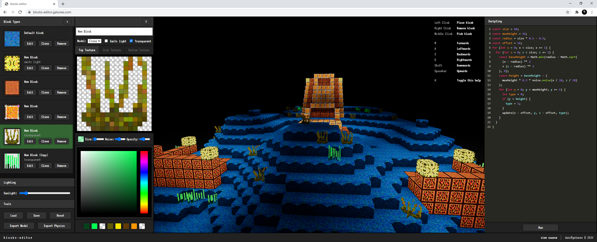

[blocks-editor](https://blocks-editor.gatunes.com/)
==

[](https://blocks-editor.gatunes.com/)

#### Examples

 * [lightmap-boilerplate](https://lightmap-boilerplate.glitch.me/) - VR + model loading + physics + lightmap
 * [space-train](https://space-train.glitch.me/) - VR + model loading
 * [multiplayer-boilerplate](https://multiplayer-boilerplate.glitch.me/) - VR + model loading + multiplayer server
 * [physics-boilerplate](https://physics-boilerplate.glitch.me/) - VR + model loading + physics
 * [physics-boilerplate-2](https://physics-boilerplate-2.glitch.me/) - VR + model loading + physics with multiple models/scales

#### Local development

```bash
# clone this repo
git clone https://github.com/danielesteban/blocks-editor.git
cd blocks-editor
# install dependencies
npm install
# start the dev environment:
npm start
# open http://localhost:8080/ in your browser
```
